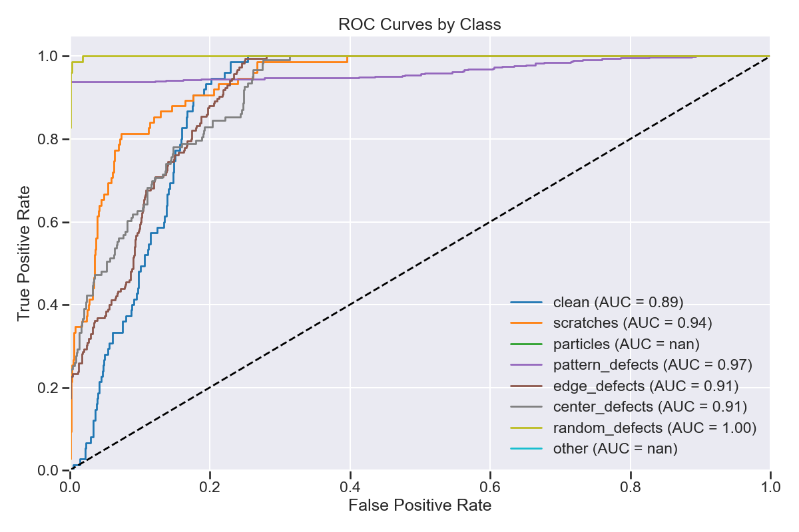

# Semiconductor Defect Detection 🔍

End-to-end deep learning solution for detecting defects on semiconductor wafers using EfficientNet-B0.



## 📌 Overview
This project classifies 8 types of semiconductor defects using transfer learning. It addresses severe operational challenges like **class imbalance** (10:1 ratio) and **visual subtlety** of defects.

**Key Features:**
- **EfficientNet-B0 Architecture**: Heavyweight performance, lightweight footprint.
- **Balanced Training Pipeline**: Automatic undersampling/oversampling to handle imbalanced datasets.
- **State-of-the-Art Results**: **0.97 F1-Score** on pattern defects, **75.3% Overall Accuracy**.
- **Edge Ready**: Deployment-ready TFLite models for NXP eIQ.

## 📂 Project Structure
- `data/` - Dataset management (Raw, Processed, Augmented).
- `models/` - EfficientNet and MobileNet model definitions.
- `training/` - Training loops, data loaders, and configuration.
- `evaluation/` - Metrics, Confusion Matrix, ROC curves.
- `inference/` - Export scripts for ONNX/TFLite.
- `submission/` - **Hackathon Deliverables (Models, Dataset, Report)**.

## 🚀 Getting Started

### Prerequisites
- Python 3.10
- GPU recommended (NVIDIA RTX 4060 used)

### Installation
```bash
# 1. Clone repository
git clone https://github.com/kavin-iesa/semiconductor-defect-detection.git
cd semiconductor-defect-detection

# 2. Install dependencies
pip install -r requirements.txt
```

### Usage

**1. Data Preparation**
```bash
# Download and curate datasets (WM811K, WaferMap, DeepPCB)
python data/curate_datasets.py

# Augment and balance the dataset (Creates 1500 images per class for training)
python data/augment.py
```

**2. Training**
```bash
# Train EfficientNet-B0 (Transfer Learning + Fine Tuning)
python training/train_simple.py
```

**3. Evaluation**
```bash
# Evaluate on Test Set
python evaluation/evaluate.py --model outputs/models/efficientnet_final_weights.h5 --split test
```

**4. Export for Deployment**
```bash
# Convert to TFLite
python inference/export.py --output submission/model
```

## 📊 Results
| Class | F1-Score |
| :--- | :--- |
| **Pattern Defects** | **0.97** |
| **Random Defects** | **0.85** |
| **Scratches** | **0.51** |
| **Center Defects** | **0.43** |

See `docs/Final_Report.md` for detailed analysis.

## 📜 License
MIT License.
